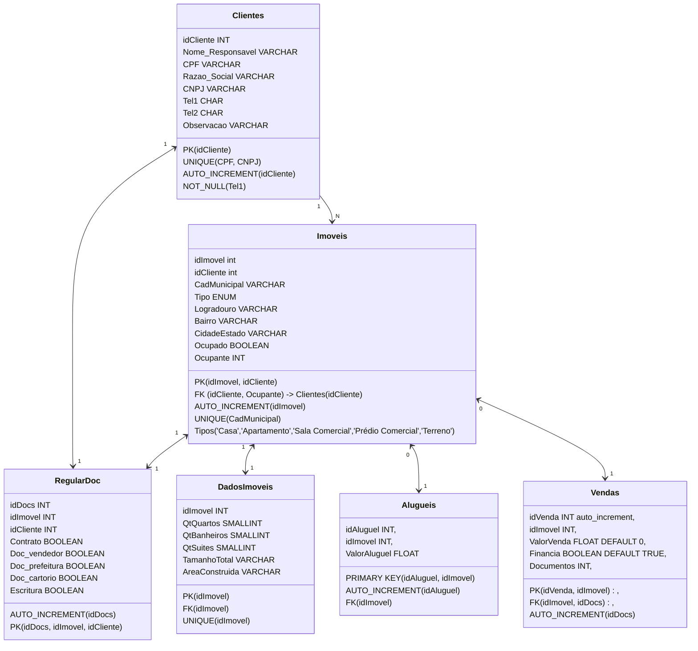

## Desafio de Projeto: *Construa um Projeto Lógico de Banco de Dados do Zero*

  

Este diretório é dedicado ao Desafio de Projeto do curso ***Potência Tech powered by iFood | Ciência de Dados***, da Digital Innovation One, módulo ***Modelagem de Dados e Projetos Lógicos na Prática com SQL***.

  

O diretório está dividido em 3 arquivos:

* Criação das tabelas;

* Inserção de dados nas tabelas;

*  *Queries* para recuperação de dados.

  

### Sobre o negócio

  

Este projeto visa o cadastro de clientes e imóveis de uma imobiliária e o controle dos serviços oferecidos.

### Lógica das tabelas

